You can also read this post [in Dutch](/posts/halen-we-het-parijsakkoord-met-het-vvd-programma)

##### The experiment

This blogpost is a thought experiment. Imagine the entire world would implement the policy from the [2021 electoral programme concept](https://www.vvd.nl/content/uploads/2020/11/Verkiezingsprogramma-concept-VVD-2021-2025.pdf) of the Dutch prime minister's party. What would be the consequences for the climate? Is the VVD ambitious enough to meet the targets in the Paris Agreement?

I try to answer this question using [the En-ROADS climate simulator](https://en-roads.climateinteractive.org/scenario.html?v=2.7.35), made by MIT Sloan School of Management and the thinktank Climate Interactive. The simulator has been calibrated by 6 "integrated assessment models", the best climate models availabe in science.

##### Disclaimer - my best guesstimate

I have to make assumptions to translate the VVD policy into measures I can enter in the simulator. These are marked in **bold**. I am merely a human being, so these assumptions are subjective by definition. Fortunately the En-ROADS climate simulator is freely available, so I would like to invite you to change my assumptions according to your own insight using the scenario links I share below.

##### The status quo

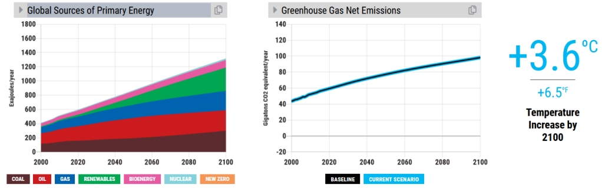

In this figure we see the business as usual scenario ([scenario link](https://en-roads.climateinteractive.org/scenario.html?g0=2&g1=62&v=2.7.35)). On the left hand side we see the estimated increase in energy use for the next 80 years. On the right hand side we see the corresponding (equivalent) CO2 emissions. If we don't intervene, temperature will rise by 3.6oC with respect to the 19th century levels by 2100. [The Paris agreement](https://unfccc.int/process-and-meetings/the-paris-agreement/the-paris-agreement) states it is desirable to limit warming well below 2oC and preferably to 1.5oC . Time for action![^1] Let's take a look at the VVD policy plans.

##### The VVD electoral programme

###### Coal

The VVD programme states: _In 2030 it will be prohibited to use coal to generate electricity. Old and polluting coal plants will be closed earlier on. Carbon Capture and Storage (CCS), (...) should be considered for the subsidies for the renewable energy transition._

I enter this in En-ROADS as follows: 100% reduction in coal use by 2030, **2%** accelerated retirement of coal plants and a reduced cost of CCS research by **5%**. You can see the effect on coal usage and worldwide CO2 emissions below. We prevent 0.4oC of temperature increase - not a bad start![^2] [Scenario link](https://en-roads.climateinteractive.org/scenario.html?p196=100&p202=2030&p4=2&p6=5&g0=2&g1=62&v=2.7.35)

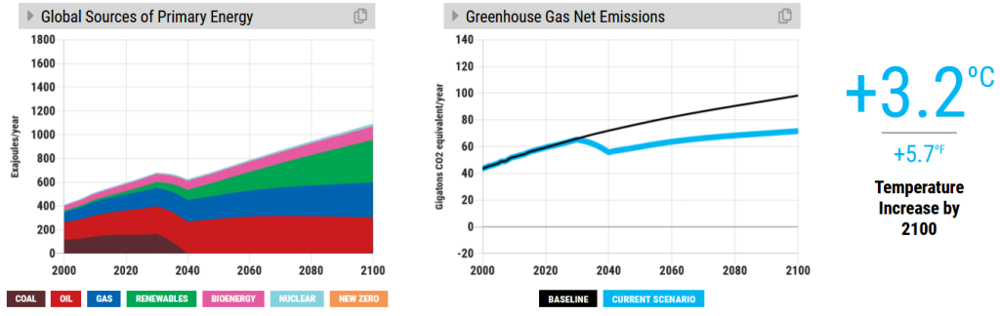

###### Gas

_We will phase out gas production in Groningen and instead we will import it from elsewhere._

Fewer earth quakes in Groningen! - yet for the rest of the world this means business as usual.

###### Nuclear energy

_On the long term nuclear energy can be a reliable and CO2 neutral energy source. Nuclear energy will receive support from the government, e.g. funding from the Growth Fund._ (...) _Nuclear energy, or the development of a thorium reactor should be considered for subsidies from the Growth Fund (SDE++)._

The [Growth fund](https://www.rijksoverheid.nl/actueel/nieuws/2021/01/14/eerste-kamer-stemt-in-met-nationaal-groeifonds) contains 20 billion euros for the next five years. On a yearly basis [the nuclear power plant in Borssele](https://www.rijksoverheid.nl/onderwerpen/duurzame-energie/opwekking-kernenergie) (the only one in the Netherlands) generates 3.3 miljoen MWh. Part of the budget of the Growth Fund could be used to subsidize nuclear energy by **0.07 $/kWh**. And let us be optimistic and assume that we will be able to develop a thorium nuclear power plant by 2040. The effect on temperature is a mere 0.1oC. There are two simple explanations. In the first place, it takes about ten years to set up the infrastructure for a nuclear reactor, so it will take some time before more reactors are up and running. Secondly subsidized nuclear energy competes with renewable energy sources. In our current scenario, more nuclear energy leads to less renewable energy, whereas we are trying to reduce fossil fuel consumption.[^3]

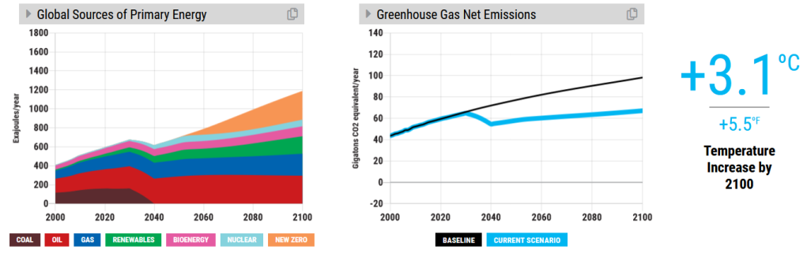

###### Hydrogen

_Large scale production, export and use of (green) hydrogen. As an energy supply we can use nuclear reactors and renewable energy sources._

Hydrogen can be used for energy storage. It can be used to power vehicles and [it can replace coal in large scale industrial processes](https://www.rechargenews.com/transition/-world-first-as-hydrogen-used-to-power-commercial-steel-production/2-1-799308), like steel production. In En-ROADS there are several possibilities to simulate this:

- Electrification of vehicles, (powered by hydrogen batteries), let's say we target **1%** of the vehicles each year. This means we replace 1% of all cars by cars with hydrogen batteries. This is fairly ambitious, since under normal circumstances roughly 3% of cars gets replaced each year.
- Electrification of industry, let's say by **1%** a year.
- Research on hydrogen storage could lead to a breakthrough which reduces storage cost. Let us assume hydrogen storage gets **10%** cheaper.

We again get 0.1oC closer to our goal. [Scenario link](https://en-roads.climateinteractive.org/scenario.html?p210=1&p196=100&p202=2030&p4=2&p6=5&p21=10&p30=-0.07&p36=2040&p53=1&p55=1&g0=2&g1=62&v=2.7.35)

###### Renewable energy

_Substantial increase in market share of renewable energy._

It is hard to quantify without a detailed strategy. I think the electoral programme can use some clarification on this point. For now, let us propose a subsidy on renewable energy of **0.02 $/kWh** (you can reach a similar effect by subsidizing renewable energy infrastructure). **0.02 $/kWh** is slighty more than 10% of [the price a consumer pays](https://www.consumentenbond.nl/energie-vergelijken/kwh-prijs). This reduces global warming by 0.1oC. We see an increase in total energy use, because energy becomes cheaper.[^4] [Scenario link](https://en-roads.climateinteractive.org/scenario.html?p210=1&p196=100&p202=2030&p4=2&p6=5&p16=-0.02&p21=10&p30=-0.07&p36=2040&p53=1&p55=1&g0=2&g1=62&v=2.7.35)

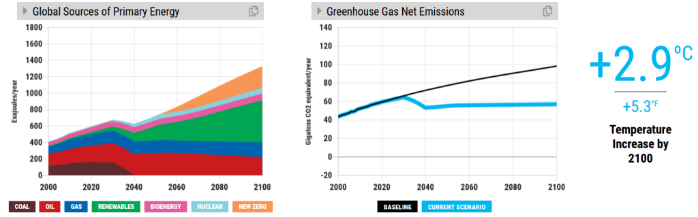

###### Biomass

_Stop subsidies for burning biomass from wood for electricity generation. Current subsidies can only stay for wood scraps and wood from ancient forests gets excluded. Standards for the emission of particulates by biomass plants will be raised._

Increase standards cannot be simulated in En-ROADS, let's say that a tax on biomass of **$10 per barrel of oil-equivalent** has a similar effect. Protection of ancient forests can be simulated as decreased deforestation, with **2% per year** for instance. The total amount of used bioenergy decreases somewhat on the long term, but it is not enough to cause significant temperature change. [Scenario link](https://en-roads.climateinteractive.org/scenario.html?p210=1&p196=100&p202=2030&p4=2&p6=5&p16=-0.02&p21=10&p23=10&p30=-0.07&p36=2040&p53=1&p55=1&g0=2&g1=62&v=2.7.35)

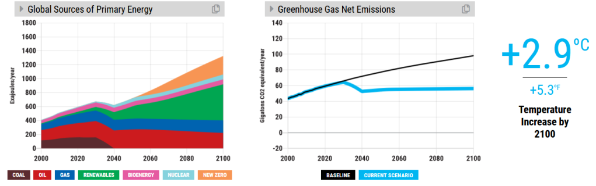

###### Electrical cars

As part of it's legacy the VVD party is required to spend at least half a page of their electoral programme on cars (and can't resist noting that petrol motors sound awesome). Fortunately, they mention electrification of cars. Let's add electricification[^5] of **1%** of the entire fleet each year. This is in addition to the hydrogen powered cars we added to the fleet. There is a small reduction in the amount of petrol used, but not enough to make a significant difference. [Scenario link](https://en-roads.climateinteractive.org/scenario.html?p210=1&p196=100&p202=2030&p4=2&p6=5&p16=-0.02&p21=10&p23=10&p30=-0.07&p36=2040&p53=2&p55=1&g0=2&g1=62&v=2.7.35)

###### Carbon tax

_Lower energy tax for households and SMEs. (...) Introduction of tax on energy use for heavy industries (...) Raised standars of the European emission trading system ETS by reduction of the number of CO2-emission allowances._

Industrial energy use constitutes [26%](https://www.sciencedirect.com/topics/engineering/industrial-energy-consumption) of European energy use. The current price paid for emissions is [€30 per tonne](https://www.reuters.com/article/eu-carbon-idUSL5N2EK1E6). Suppose the VVD plans to increase this to **€50 per tonne**. Since we are talking about a quarter of the energy use, the effective price is €12.5 per tonne. On top of that the VVD plans to make energy cheaper for households and SMEs. Let's assume we are left with an effective tax of **€8 per tonne**. This would bring us again 0.1oC closer to our goal, because total the renewable energy share increases. [Scenario link](https://en-roads.climateinteractive.org/scenario.html?p210=1&p196=100&p202=2030&p4=2&p6=5&p16=-0.02&p21=10&p23=10&p30=-0.07&p36=2040&p39=8&p53=2&p55=1&g0=2&g1=62&v=2.7.35)

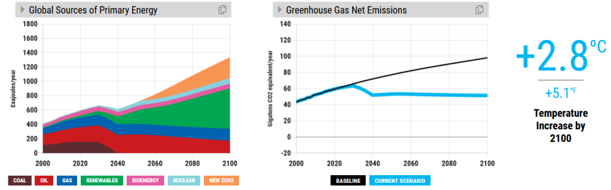

###### Increased energy efficiency of buildings

_Acces for SMEs to the heat fund which is currently availabe for home owners to insulate their homes.(...) Additional tax benefits for home owners who insulate their homes. (...) Subsidies for housing associations to improve sustainability of their property._

Let us enter improved sustainability of **2%** of all buildings each year. This will lead to a decrease of global warming by 0.1oC. [Scenario link](https://en-roads.climateinteractive.org/scenario.html?p210=1&p196=100&p202=2030&p4=2&p6=5&p16=-0.02&p21=10&p23=10&p30=-0.07&p36=2040&p39=8&p47=2&p53=2&p55=1&g0=2&g1=62&v=2.7.35)

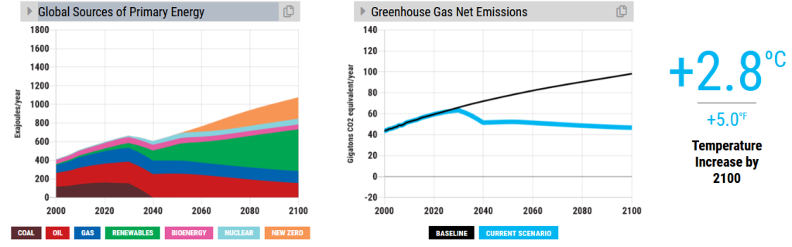

###### Recycling

_Facilitate recycling, reuse and longer product lifetimes_

This leads to more efficient energy use in industry (let's say by **1%** a year) and furthermore decreases waste emissions (I entered **2%** per year). Slowly but steadily we reach our goal, we are again 0.1oC closer. [Scenario link](https://en-roads.climateinteractive.org/scenario.html?p209=1&p210=1&p196=100&p202=2030&p4=2&p6=5&p16=-0.02&p21=10&p23=10&p30=-0.07&p36=2040&p39=8&p47=3&p53=2&p55=1&p60=-2&g0=2&g1=62&v=2.7.35)

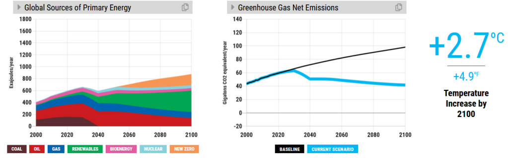

###### Methane and other green house gases

_Stop the use of non-essential, dangerous substances. (...) Reduce emissions of green house gases and nitrogen from agriculture by innovative techniques such as precision agriculture and low emission barns.(...) Increase of the ground water level in fens to reduce natural emission of green house gases._ _(...)_ _Agreements with food producers and supermarkets to supply and promote more healthy food._ (...) _Reduction of damaging emissions of livestock farming close to natural reserves._ (...)_Farmers willing to cease livestock farming in regions with a high livestock density can get support from the government. Financial support for farmers who invest in low emission farming.._

Let us assume we reduce the use of methane, nitrogen dioxide, PFCs en HFCs in industry by **10%**, and reduce agricultural emissions by **10%**. This brings us another 0.1oC closer to the Paris agreement. [Scenario link](https://en-roads.climateinteractive.org/scenario.html?p209=1&p210=1&p196=100&p202=2030&p4=2&p6=5&p16=-0.02&p21=10&p23=10&p30=-0.07&p36=2040&p39=8&p47=3&p53=2&p55=1&p60=-12&p61=-10&g0=2&g1=62&v=2.7.35)

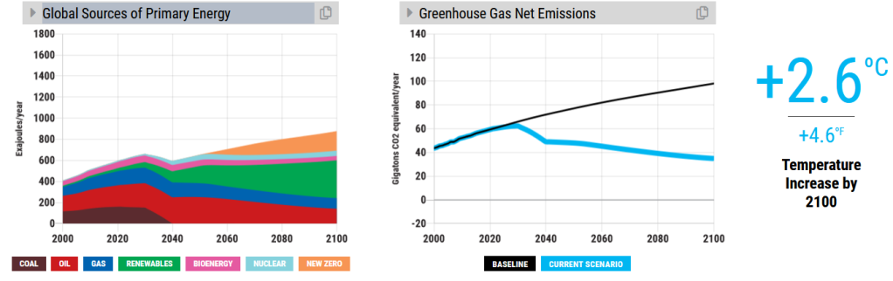

###### Increased sustainability of mobility and transport

The VVD programme proposes a range of measures to achieve this, such as raised emission standards for manufacturers of vehicles, a tax on kerosine and cleaner motors for inland vessels. Furthermore they propose improvements of roads, railways, cycling lanes and waterways, better connections for international trains and mobility as a service. At the same time they state the international position of Schiphol airport should be strengthened and more efficient flight routes should be investigated.

Increased efficiency of vehicles by **2% a year** (with respect to the current increase of 0.5% a year) and a tax on kerosene of **$10 per barrel of oil-equivalent** would bring us yet again 0.1oC closer to our goal. The benefits of efficient flight routes, especially on short flights is rather small since most energy is used [during take-off and landing](https://www.natuurenmilieu.nl/themas/mobiliteit/projecten-mobiliteit/luchtvaart/het-probleem/). No matter how well you plan, it seems difficult to avoid these parts of a flight. [Scenario link](https://en-roads.climateinteractive.org/scenario.html?p209=1&p210=1&p196=100&p202=2030&p4=2&p6=5&p7=10&p16=-0.02&p21=10&p23=10&p30=-0.07&p36=2040&p39=8&p47=3&p50=2.5&p53=2&p55=1&p60=-12&p61=-10&g0=2&g1=62&v=2.7.35)

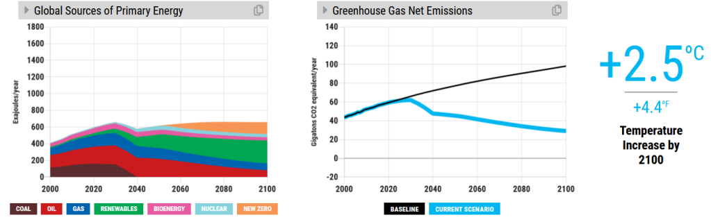

###### Conservation of gas infrastructure

_Conserve as much gas infrastructure as possible while changing energy supplies. We can adapt gas infrastructure to supply households with hydrogen or green gas._

To supply houses with energy from hydrogen, we need to convert electricity into hydrogen. This process has an energy efficiency of about 80%, meaning we waste about 20% of the energy. Hence it is more efficient to heat a home with electricity. The only advantage when it comes to sustainability is the possibility to store hydrogen in tanks, which increases buffer capacity. Yet it won't prevent any temperature increase.

###### Forest

_Afforestation in linked natural reserves._

[54 %](https://www.cbs.nl/nl-nl/nieuws/2016/08/minder-landbouw-meer-natuur) of the surface area of the Netherlands is used for agriculture. Let us assume we use **1%** for afforestation (not necesarily agricultural land, we could also turn Lake IJssel into a swamp forest, for instance). If we scale this to the entire planet, we will face some challenges, like regions with irregular rainfall, with increased demand for agricultural land or with Jair Bolsonaro as a president (or all of the above). To get an idea of the extent of this operation: 1% of worldwide surface area would correspond to two times the area of India!Unfortunately planting trees is a bit of a hype, and the emissions from energy use are orders of magnitude larger than what trees can compensate for. This titanic effort brings us only 0.1oC closer to our goal. We shouldn't forget to mention the positive effect on biodiversity though.[^6] [Scenario link](https://en-roads.climateinteractive.org/scenario.html?p209=1&p210=1&p196=100&p202=2030&p4=2&p6=5&p7=10&p16=-0.02&p21=10&p23=10&p30=-0.07&p36=2040&p39=8&p47=3&p50=2.5&p53=2&p55=1&p60=-12&p61=-10&p65=100&g0=2&g1=62&v=2.7.35)

###### Innovation

_We strengthen knowledge hubs such as Brainport Eindhoven and Foodvalley Wageningen. (…) We experiment with partnerships between educational institutions, industry and the government to contribute to solutions leading to a healthy soil, sustainable fertilization use and sustainable food production._

Innovations in agriculture (which could also be meat substitutes or in vitro meat) could lead to a smaller emission of methane and nitrogen dioxide, say by **5%**. Furthermore we could develop technological innovations for carbon removal, such as [biochar](https://www.american.edu/sis/centers/carbon-removal/fact-sheet-biochar.cfm), [regenerative agriculture](https://www.american.edu/sis/centers/carbon-removal/fact-sheet-soil-carbon-sequestration.cfm)[^7] and [mineralisation](https://www.american.edu/sis/centers/carbon-removal/fact-sheet-enhanced-mineralization.cfm)). Let us assume these technologies all reach **33%** of their full potential, as they don't exist on large scales yet. We end up with another 0.2oC decrease in temperature rise. [Scenario link](https://en-roads.climateinteractive.org/scenario.html?p208=2&p209=1&p210=1&p196=100&p202=2030&p4=2&p6=5&p7=10&p16=-0.02&p21=10&p23=10&p30=-0.07&p36=2040&p39=8&p47=3&p50=2.5&p53=2&p55=1&p60=-17&p61=-10&p65=100&p72=33&p74=33&p76=33&p77=2030&g0=2&g1=62&v=2.7.35)

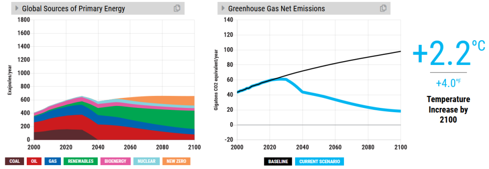

##### Conclusion

I conclude that the VVD policy would lead to a temperature increase of 2.2oC (please mind the [disclaimer]("#h5")!). This would have disastrous effects[^8], but I see some reasons for cautious optimism:

- The VVD usually rules the country together with more progressive parties.
- This is a _concept_ electoral programme, so there is room for improvement (I will write about it soon in [a new blogpost](/posts/dutch-climate-policy-suggestions-for-improvement/))
- If we show people what is necessary in terms of climate action, we can create societal acceptance for a more progressive climate policy (for example using the (free!) [En-ROADS climate workshop](https://www.climateinteractive.org/tools/en-roads/the-en-roads-climate-workshop/))

##### Feedback

Let me know what does not make sense to you! Adapt [the final scenario](https://en-roads.climateinteractive.org/scenario.html?p208=2&p209=1&p210=1&p196=100&p202=2030&p4=2&p6=5&p7=10&p16=-0.02&p21=10&p23=10&p30=-0.07&p36=2040&p39=8&p47=3&p50=2.5&p53=2&p55=1&p57=-2&p60=-17&p61=-10&p65=100&p72=33&p74=33&p76=33&p77=2030&g0=2&g1=62&v=2.7.35) yourself. Did I overlook any important policies in the VVD programme? You can reach me at _enroads \[at\] his.ke_ or via LinkedIn.

##### More information on En-ROADS

Curious about the En-ROADS climate workshop? Participate in the workshop [on the En-ROADS website](https://www.climateinteractive.org/get-involved/webinars/) (mostly in English), watch a [long](https://www.youtube.com/watch?v=R9W_KEXNzm4&t=0s) or a [short](https://www.youtube.com/watch?v=u5mrnkOJdso) workshop recording on YouTube or contact an [En-ROADS climate ambassador](https://www.climateinteractive.org/tools/en-roads/climate-ambassadors/) for an interactive workshop in your preferred language.

[^1]: Fortunately Mark Rutte [agrees](https://www.cas2021.com/documents/videos/2021/01/11/mp-video-message).

[^2]: On the En-ROADS website you can read more about [co-benefits](https://docs.climateinteractive.org/projects/en-roads/en/latest/guide/coal.html#potential-co-benefits-of-discouraging-coal) of reduced coal consumption.

[^3]: More information about the possibilities and risks of nuclear energy can be found [here](https://docs.climateinteractive.org/projects/en-roads/en/latest/guide/nuclear.html)

[^4]: Interested in co-benefits of investments in renewable energy sources? Some are listed [here](https://docs.climateinteractive.org/projects/en-roads/en/latest/guide/renewables.html#potential-co-benefits-of-encouraging-renewables).

[^5]: The consequences of lithium mining in Chile have been nicely [documented by NTR. (in Dutch)](https://www.ntr.nl/Bodem-in-zicht/384/detail/Lithium/VPWON_1309236). Improved sustainability of lithium mining is an important problem to tackle.

[^6]: Read more about [co-benefits regarding biodiversity and air quality](https://docs.climateinteractive.org/projects/en-roads/en/latest/guide/afforestation.html#potential-co-benefits-of-increasing-afforestation)

[^7]: ["Kiss the ground"](https://kissthegroundmovie.com/) is a nice documentary on regenerative agriculture

[^8]: Read more about [the difference between 1.5oC and 2oC](https://www.wri.org/blog/2018/10/half-degree-and-world-apart-difference-climate-impacts-between-15-c-and-2-c-warming) global warming
