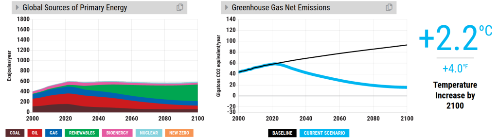
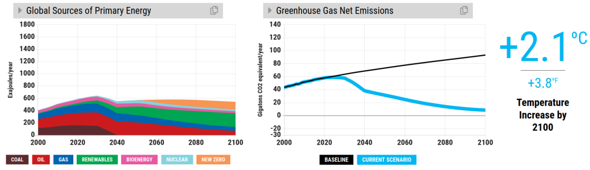

You can also read this post [in Dutch](/posts/het-vvd-klimaatbeleid-suggesties-voor-verbetering/)

##### The experiment

[In a previous blogpost](/posts/climate-policy-of-the-dutch-prime-ministers-party-vvd/) I conducted a thought experiment. We imagined what would happen if the whole world would implement the policy from the [2021 electoral programme concept](https://www.vvd.nl/content/uploads/2020/11/Verkiezingsprogramma-concept-VVD-2021-2025.pdf) of the Dutch prime minister's party. What would be the consequences for the climate? Is the VVD ambitious enough to meet the targets in the Paris Agreement?

I tried to answer these questions using [the En-ROADS climate simulator](https://en-roads.climateinteractive.org/scenario.html?v=2.7.35), made by MIT Sloan School of Management and the think tank Climate Interactive. The simulator has been calibrated by 6 "integrated assessment models", the best climate models available in science. I estimated that applying the VVD policy on a worldwide scale would lead to a rise in temperature of roughly 2.2oC, so their plans won't meet the Paris target.

How can we improve the VVD climate policy? In this blogpost I'll make a few suggestions. I'll start with the ones which in my opinion fit well with the VVD philosophy and I'll gradually deviate from their ideas. So in case you find yourself thinking halfway through 'what is this leftwing propaganda?', please stop reading and send me an e-mail with your opinion at _enroads \[at\] his.ke_ (seriously, I'd be delighted!).

##### Carbon tax for everyone

The VVD electoral programme states: _A lower energy tax for households and SMEs._

Why wouldn't you encourage SMEs and individuals to save energy? This VVD proposal discourages innovation. Of course, tax leads to an increased burden, which needs to be compensated with other tax reductions (via VAT, income tax or allowances for instance).

If you truly believe in a free market, you can in principle remove all measures the VVD proposes in the energy sector, and instead reach the same result with a carbon tax. I adapted [the end scenario from my previous blogpost](https://en-roads.climateinteractive.org/scenario.html?p208=2&p209=1&p210=1&p196=100&p202=2030&p4=2&p6=5&p7=10&p16=-0.02&p21=10&p23=10&p30=-0.07&p36=2040&p39=8&p47=3&p50=2.5&p53=2&p55=1&p57=-2&p60=-17&p61=-10&p65=100&p72=33&p74=33&p76=33&p77=2030&v=2.7.36) to demonstrate this. I have reset all policy changes the VVD proposed in the energy sector and instead [simulated a carbon tax of 110$/ton CO2](https://en-roads.climateinteractive.org/scenario.html?p208=2&p209=1&p39=110&p47=3&p50=2.5&p53=2&p55=1&p57=-2&p60=-17&p61=-10&p65=100&p72=33&p74=33&p76=33&p77=2030&v=2.7.36). It has the same effect in terms of temperature increase by 2100.

A carbon tax of110$/ton CO2 has the same effect on global temperature as all measures in the energy sector which the VVD proposed.

In the long run a carbon tax can only be successful on a European or a worldwide scale. The VVD propose: _A European border tax for CO2 to avoid unfair competition on a worldwide scale._ I think their programme is lacking willingness to significantly extend the current carbon tax and to lobby for this policy on an EU level.

##### Improve societal acceptance

_The climate debate has polarized a lot in recent decades(...) Fanatics abuse climate policy as an ideological instrument to patronize others and impose a different life style.(...) To build solar parks and wind mill parks on land obtaining societal acceptance by the local population is essential._

The VVD acknowledges that societal acceptance is an important aspect of climate policy. They don't propose any views on how to improve societal acceptance though. I'd like to present three ideas, related to education, citizens' assemblies and _multisolving_.

###### Education

Good climate education is vital for the future. To increase societal acceptance, we need to turn an abstract problem like climate change into something more tangible. On top of that people need to have an understanding of the interactions within the climate system to propose effective policies to tackle climate change. This is why I think the [En-ROADS climate simulator](https://en-roads.climateinteractive.org/scenario.html?v=2.7.36) is a great example of a tool which can be used to teach and learn about climate change. You can use it to experiment with climate policy by yourself, or follow [a workshop](https://www.climateinteractive.org/tools/en-roads/the-en-roads-climate-workshop/) or join a [climate action simulation game](https://www.climateinteractive.org/tools/climate-action-simulation/). More informed dialogue using these or similar materials seems a great way to improve societal acceptance. (Please let me know which resources you recommend!)

###### Citizens' assemblies

A citizens' assembly can bridge the gap between politics and society. [^1] By selecting participants at random, different groups in society can voice their opinion. A few interesting initiatives:

- The citizens' assembly organized in Texas between 1996 and 1998 has increased the willingness to pay something extra for wind and solar energy from [52% of the population to 84% of the population.](https://cdd.stanford.edu/mm/2000/utility_paper.pdf)
- The French president Macron has accepted [146 of the 149 recommendations](https://www.nrc.nl/nieuws/2020/07/03/laat-burgers-politici-helpen-organiseer-een-burgerberaad-a4004913) made by the French climate citizens' assembly last year.
- In the Foodvalley region in the Netherlands, a [cizitens' assembly is being consulted](https://www.regiofoodvalley.nl/programma/energietransitie/naar-res-10/raadpleging-en-burgerforum) on the regional energy strategy.

###### Multisolving

Informing people about co-benefits of climate policy is important. Even people who are maybe not interested in tackling climate change, might support climate policy for other reasons. A few examples:

A higher tax on meat would not only reduce CO2 emissions, but would also be beneficial for public health. On top of that, it would reduce deforestation, which in its turn leads to increased biodiversity and [reduced spread of dangerous viruses](https://www.youtube.com/watch?v=_v-U3K1sw9U). Finally a smaller cattle population would alleviate [the current nitrogen problem](https://www.wur.nl/en/Dossiers/file/Nitrogen.htm) in the Netherlands.

Increased public transport does not only reduce missions, but improves air quality as well. In London [air pollution has been identified as the cause of death](https://www.theguardian.com/environment/2020/dec/16/girls-death-contributed-to-by-air-pollution-coroner-rules-in-landmark-case) of a 9-year old last year. According to [a study](https://www.sciencedirect.com/science/article/abs/pii/S0013935121000487) 8.7 million people died pollution by fossil fuels in 2018. This is a problem in the Netherlands as well: in the region around the steel ovens close to IJmuiden there is [a highly elevated percentage of the population suffering from lung cancer](https://www.nrc.nl/nieuws/2020/11/17/fors-meer-longkankergevallen-in-omliggende-gemeenten-tata-steel-a4020453). [^2] On top of that increased use of public transport leads to more physical activity, which reduces the chance of getting numerous life style diseases (not to mention COVID-19).

The En-ROADS website has many more examples of multisolving. You can read about [recycled toilet paper in Dutch cycleways](https://www.climateinteractive.org/multisolving-in-action/examples-of-multisolving/the-netherlands-recycles-toilet-paper-to-pave-bike-paths/) and [fewer sleep disruptions by energy savings](https://www.climateinteractive.org/ci-topics/multisolving/multisolving-at-the-intersection-of-health-and-climate/operation-tlc/) in hospitals.

##### Learn from past mistakes

It seems crucial to me to learn from the mistakes which have been made in the past few years. A few observations:

- [The nitrogen problem](https://www.wur.nl/en/Dossiers/file/Nitrogen.htm) has demonstrated that delaying policy measures escalates problems. So I find it worrying when [the VVD member of parliament Mark Harbers](https://www.nrc.nl/nieuws/2021/02/23/over-klimaat-discussieren-de-partijen-nog-niet-a4032968) says: "_I think we need to take things easy: lets give ourselves a few years to implement the measures which have already been agreed upon._" Right... [the environmental planning agency (PBL) has already calculated](https://www.pbl.nl/en/news/2020/climate-and-energy-outlook-2020-achieving-urgenda-reduction-target-2020-is-uncertain-cabinet-target-for-2030-not-yet) that the plans of the current administrations are insufficient to meet the targets set for 2030. Recent studies show that [electrification of industry](https://www.nrc.nl/nieuws/2021/02/15/industriedoel-klimaatakkoord-voor-2030-komt-nu-al-in-gevaar-a4031913) and [improving energy efficiency of buildings](https://www.nrc.nl/nieuws/2021/02/17/pbl-rijk-moet-bijspringen-bij-verduurzaming-woningen-a4032283) is taking more time than anticipated. So let's NOT take things easy and pass on more problems to the next generation.
- [Energy consumption by datacenters](https://newsabc.net/lubach-cracks-bizarre-windmill-policy-and-twitter-pops-up-on-mafioso-wiebes/) leads to a gigantic energy demand. Leaving procurement of projects which consume astronomical amounts of energy to local governments is a bad idea. It leads to tax payers subsidizing cheap renewable energy for wind parks for multinationals. This way we fail to meet our targets for renewable energy ([we have the dirties energy mix in the EU!](https://ec.europa.eu/eurostat/documents/2995521/10335438/8-23012020-AP-EN.pdf/292cf2e5-8870-4525-7ad7-188864ba0c29)) and we have to pay Denmark for renewable energy to make up for our failure to meet targets. I don't see any proposals in the VVD programme to prevent fiascos like this one from happening again.
- Vague ambitions won't lead to concrete results. Without control by the government [the industry doesn't meet the required renewable energy targets.](https://www.nrc.nl/nieuws/2021/01/03/grote-bedrijven-maken-hun-belofte-om-energie-te-besparen-niet-waar-a4025985) Striving for a 50% reduction of use of raw materials sounds great, but even the [environmental planning agency doesn't know](https://www.pbl.nl/en/publications/circular-economy-what-we-want-to-know-and-can-measure) how many resources we are currently using.

##### Helping developing countries

The VVD programme states: _The expenses on regional shelter for Syrian refugees in Turkey and Jordan have been a good investment in recent years. This does not hold for traditional development aid to poor countries._ (...) _Extra funds for emergency relief at the cost of well-intended but ineffective long term projects. When assigning funds for emergency relief, prevention of migratory flows should be prioritized._

I'd say these statements are poorly motivated. I do agree that it is possible to point out development aid projects which did not achieve the intended results or weren't cost effective. Yet there are more than enough projects which deserve our support.

I'd like to mention the non-governmental organization [BRAC](http://brac.net/) from Bangladesh for instance, which has alleviated a significant fraction of Bangladeshi from poverty. Their success can be attributed to their critical project evaluations and constant revisions, as can be read in [The Guardian](https://www.theguardian.com/global-development/2020/jan/07/sir-fazle-hasan-abed-obituary). The projects ran by BRAC are so successful that they can generate [83%](http://www.brac.net/index.php/partnership) of their income themselves.

Let's return to the VVD statement about 'good investments' : the effective altruism movement has done a lot of research on cost effective charities. In [their top 9](https://www.givewell.org/charities/top-charities) there isn't any organization focusing on emergency relief. Focus on prevention of migratory streams seems rather ineffective to me (and inhumane as well), especially when the consequences of climate change aggravate. Stopping migratory streams is a way to treat symptoms, not to treat a root cause, as is clearly illustrated in [a recent documentary](https://www.ruetir.com/2021/01/06/film-about-the-lost-boys-who-roam-europe/) about minors from Tunesia in Europe. The focus on stopping migratory streams is a typical example of a shortcoming of an event-based view which I discussed [in my previous blogpost](/posts/dutch-climate-policy-and-the-importance-of-systems-thinking/).

The potential of development aid can be explored using the En-ROADS climate simulator. Better education of girls, better education on family planning and a better offer of contraception can lead to reduced population growth.[^3] On top of that farmers in developing countries can profit from education on sustainable farming practices, such as agroforestry. These are again multisolving solutions, which do not only tackle climate change, but also lead to emancipation, income guarantees for farmers and reduced migratory flows. This approach can bring us another 0.1oC closer to the Paris agreement. [Scenario link](https://en-roads.climateinteractive.org/scenario.html?p208=2&p209=1&p210=1&p196=100&p202=2030&p4=2&p6=5&p7=10&p16=-0.02&p21=10&p23=10&p30=-0.07&p36=2040&p39=8&p47=3&p50=2.5&p53=2&p55=1&p57=-2&p60=-17&p61=-10&p63=-1.0000&p65=100&p72=33&p74=33&p76=100&p77=2030&g0=2&g1=62&v=2.7.36)

Development aid by education on family planning and sustainable agricultural practices in En-ROADS

Examples of interesting projects in this area:

- The [PIP project](https://www.wur.nl/en/Research-Results/Research-Institutes/Environmental-Research/Programmes/Sustainable-Land-Use/Sustainable-production-systems/The-PIP-approach-building-a-foundation-for-sustainable-change.htm), in which farmers learn about sustainable farming practices. They don't receive any monetary support, but need to be intrinsically motivated to participate.
- The [Solar Sister](https://www.climateinteractive.org/multisolving-in-action/multisolving-leaders/solar-sister-empowers-women-and-delivers-clean-energy-in-africa/) project, which supports women in Africa to set up their own enterprise selling solar lighting and clean cookstoves.

In my opinion, inhabitants of developed countries with large historical carbon footprints have a moral obligation to aid developing countries in their development, especially if we want to prevent these countries from emitting as much CO2 as we have done in the past. But even when setting aside this moral conviction there are plenty of reasons to help developing countries.

##### Conclusion

I think the following insights are lacking in the VVD climate policy:

- A carbon tax for everyone. We should all be encouraged to save energy. Maintaining household purchasing power and competitiveness of SMEs can be arranged via other means.
- Societal acceptance of climate policy can be improved by adequate education, citizens' assemblies and emphasis on multisolving.
- It is crucial to learn from past mistakes (the nitrogen problems, datacenter energy use and vague policies without enforcement, to name a few).
- Development aid in terms of education for girls and education on sustainable farming practices can contribute to tackling climate change.

To reach the targets from the Paris agreement the other measures proposed in the VVD programme need to be scaled up in ambition. You can try for yourself what it takes to reach 1.5oC global warming, starting [from our latest VVD scenario](https://en-roads.climateinteractive.org/scenario.html?p208=2&p209=1&p210=1&p196=100&p202=2030&p4=2&p6=5&p7=10&p16=-0.02&p21=10&p23=10&p30=-0.07&p36=2040&p39=8&p47=3&p50=2.5&p53=2&p55=1&p57=-2&p60=-17&p61=-10&p63=-1.0000&p65=100&p72=33&p74=33&p76=100&p77=2030&v=2.7.36).

##### Feedback

What do you think of the policies I propose? Do you think their are other major improvements for the VVD climate policy? You can reach me at _enroads \[at\] his.ke_ or via LinkedIn.

##### More information on En-ROADS

Curious about the En-ROADS climate workshop? Participate in the workshop [on the En-ROADS website](https://www.climateinteractive.org/get-involved/webinars/) (mostly in English), watch a [long](https://www.youtube.com/watch?v=R9W_KEXNzm4&t=0s) or a [short](https://www.youtube.com/watch?v=u5mrnkOJdso) workshop recording on YouTube or contact an [En-ROADS climate ambassador](https://www.climateinteractive.org/tools/en-roads/climate-ambassadors/) for an interactive workshop in your preferred language.

[^1]: David van Reybrouck wrote [an interesting book](https://www.theguardian.com/books/2016/jul/18/against-elections-the-case-for-democracy-david-van-reybrouck-review) on this topic.

[^2]: [The Lancet Countdown](https://www.thelancet.com/journals/lancet/article/PIIS0140-6736(20)32290-X/fulltext) makes a yearly overview of the impacts of climate change on human health. [The ClientEarth case](https://www.clientearth.org/latest/press-office/press/breaking-eu-s-biggest-coal-plant-must-negotiate-closure-with-environmental-lawyers-court-decides/) against Polish coal power plants is an interesting read as well.

[^3]: Family planning should always be voluntary and empower people to make choices that are best for them. It is a delicate issue because of [numerous forced sterilizations](https://docs.climateinteractive.org/projects/en-roads/en/latest/guide/population.html) of women of color throughout the course of history.
