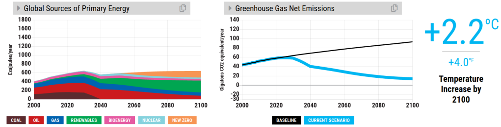

Dutch version [here](/posts/verkiezingsblogposttrilogie/)

In my election blogpost trilogy I analyze the climate policy of the Dutch prime ministers party (VVD) using the [En-ROADS climate simulator](https://en-roads.climateinteractive.org/scenario.html?v=2.7.36).

Part 1: [Climate policy of the Dutch prime minister's party (VVD)](/posts/climate-policy-of-the-dutch-prime-ministers-party-vvd/)

Part 2: [Dutch climate policy and the importance of systems thinking](/posts/dutch-climate-policy-and-the-importance-of-systems-thinking/)

Part 3: [Dutch climate policy - suggestions for improvement](/posts/dutch-climate-policy-suggestions-for-improvement/)

The En-ROADS climate simulator
