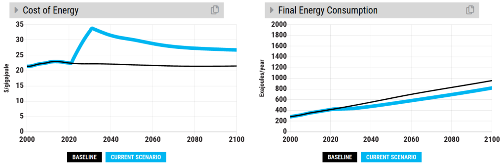

##### Het experiment

[In een vorige blogpost](/posts/halen-we-het-parijsakkoord-met-het-vvd-programma/) schreef ik over een gedachte-experiment. Stel dat de hele wereld het beleid uit [het concept-verkiezingsprogramma](https://www.vvd.nl/content/uploads/2020/11/Verkiezingsprogramma-concept-VVD-2021-2025.pdf) van de VVD van 2021 zou uitvoeren. Wat zouden dan de gevolgen zijn voor het klimaat? Zijn de ambities van de VVD voldoende om onze beloftes uit het Parijsakkoord waar te maken?

Deze vraag probeerde ik te beantwoorden met behulp van [de En-ROADS climate simulator](https://en-roads.climateinteractive.org/scenario.html?v=2.7.35), gemaakt door MIT Sloan School of Management en de denktank Climate Interactive. De simulator is gecalibreerd aan de hand van 6 "integrated assessment models", dit zijn de beste klimaatmodellen die er in de wetenschap ontwikkeld zijn.

Ik schatte dat het beleid van de VVD op mondiale schaal zou leiden tot een temperatuurstijging van ongeveer 2.2oC, dus het Parijsakkoord zou niet worden gehaald, maar wellicht was dit niet de belangrijkste boodschap. In deze blogpost wil ik nog een aantal punten illustreren aan de hand van dat gedachte-experiment.

##### Geen wondermiddel

Tegen klimaatverandering bestaat geen wondermiddel. Zoals we in het gedachte-experiment zagen, zullen we op vele vlakken moeten ingrijpen om de doelstellingen uit het Parijsakkoord te halen. De En-ROADS simulator laat zien dat er wél nog veel verschillende mogelijkheden zijn om het Parijsakkoord te halen, zolang we nu in actie komen. [Hier](https://en-roads.climateinteractive.org/scenario.html?v=2.7.36) is de simulator, probeer het zelf eens uit!

Helaas te mooi om waar te zijn...

##### Ordes van grootte

Natuurlijk, alle kleine beetjes helpen [^1], maar het is wel belangrijk dat we de relatieve impact van verschillende maatregelen begrijpen. [^2] Hoe verhoudt het effect van een belasting op CO2 zich tot het massaal aanplanten van bomen, bijvoorbeeld? Dit kun je zelf uitzoeken met de [En-ROADS simulator](https://en-roads.climateinteractive.org/scenario.html?p39=2&v=2.7.36). Verder zijn ordes van grootte ook belangrijk om te begrijpen hoeveel impact interventies kunnen hebben. Neem bijvoorbeeld het idee om frituurvet als biobrandstof te gebruiken. Dat is een nuttige bestemming voor een reststof, maar in 2011 is al [uitgerekend](https://www.nrc.nl/nieuws/2011/01/29/biodieselproblemen-11992569-a1326913) dat we jaarlijks ongeveer 8 L per hoofd van de bevolking produceren, dus we moeten flink wat extra patat gaan eten om onze benzine en kerosine te vervangen met biobrandstof uit frituurvet.

##### Het belang van systeemdenken

Wanneer we maatregelen bedenken om klimaatverandering tegen te gaan, is het essentieel om naar het gehele systeem te kijken waarin we die maatregelen toepassen. Vaak zijn we geneigd om te denken in te simpele structuren, zoals hieronder geschetst.

Rechtlijinige kijk op de wereld. Bron: Business Dynamics, John D. Sterman, figuur 1.3

Het probleem in complexe systemen is dat we vaak vergeten de reactie van het systeem op ons handelen in overweging te nemen. Twee voorbeelden uit het VVD programma:

###### Filebestrijding

Volgens de VVD moeten er in Nederland meer wegen worden aangelegd. Dit komt voort uit de (pre-corona?) situatie waarin de wegen te druk zijn, wat leidt tot een onwenselijk lange reistijd en overlast door files. Het systeem reageert echter op de oplossing om meer wegen aan te leggen: mensen zullen méér gaan autorijden, en uiteindelijk staan we evenveel of meer in de file. Dit is een vrij simpel neveneffect wat in de rechtlijnige kijk over het hoofd wordt gezien.

Filebestrijding volgens een rechtlijnige kijk

###### Subsidie van duurzame energie

De VVD schrijft in haar programma over subsidies voor duurzame energie. Het beoogde doel is de vermindering van de CO2 uitstoot. De achterliggende gedachte is dat subsidie leidt tot een betere concurrentiepositie ten opzicht van fossiele energiebronnen.

Vermindering van de CO2 uitstoot in een rechtlijnige aanpak

De tekortkoming van deze aanpak is goed te zien in de En-ROADS Climate simulator. [Scenario link](https://en-roads.climateinteractive.org/scenario.html?p16=-0.03&p39=2&g0=29&g1=62&v=2.7.36) Als we groene energie subsidiëren gaat de prijs van energie omlaag (blauwe lijn, links) ten opzichte van de status quo (zwarte lijn, links). Hierdoor gaat het totale energieverbruik omhoog (rechts), en daarmee heeft deze maatregel _op zichzelf_ slechts een kleine invloed op de vermindering van CO2 uitstoot. Het reduceert de temperatuurstijging met slechts 0.2oC ten opzichte van de status quo.

Het effect van een subsidie op duurzame energie in En-ROADS

###### Wisselwerking

We moeten dus verder kijken dan onze neus lang is. Maar zelfs als onze neus zo lang zou zijn als die van Pinocchio, dan zijn we er nog niet! We moeten ons mentale model aanpassen aan de dynamische wereld waarin we leven. Dat ziet er ongeveer zo uit:

Mentaal model met wisselwerking. Bron: Business Dynamics, John D. Sterman, figuur 1.4

###### Heel veel wisselwerking

Ik heb twee versimpelde voorbeelden gegeven waarin de rechtlijnige aanpak tekort schiet. Wat de realiteit ingewikkelder maakt, is dat er ongelooflijk veel wisselwerkingen zijn, die ook nog eens veranderen in de loop van de tijd. Daarom is een model als En-ROADS, waarin een groot aantal wisselwerkingen in rekening worden gebracht, erg nuttig. Het systeemdiagram van het bruto nationaal product in En-ROADS ziet er bijvoorbeeld als volgt uit (en dat is nog maar een klein onderdeel van het gehele klimaatmodel!).

Systeemdiagram van het bruto nationaal product. Bron: [En-ROADS reference guide](https://img.climateinteractive.org/wp-content/uploads/2021/01/En-ROADS_Reference_Guide_012221.pdf)

Gelukkig hoef je dit systeem niet te doorgronden om zelf met de simulator aan de slag te gaan - ingewikkelde ketens van oorzaak en gevolg worden vanzelf op de achtergrond gemodelleerd.

##### Denk goed na over je doel

Eén belangrijk aspect in een complex systeem is dat je als beleidsmaker goed moet nadenken wat voor gedrag je wilt belonen. We hebben al gezien dat een subsidie op duurzame energie op zichzelf vrij weinig effect heeft op vermindering van de CO2 uitstoot, doordat het energiegebruik stimuleert. Als we ons vermindering van uitstoot ten doel stellen, kunnen we het beste vermindering van uitstoot direct belonen. Met een significante belasting op CO2 uitstoot, bereiken we een veel groter effect dan met een subsidie op duurzame energie: de belasting reduceert de temperatuurstijging met 0.7oC ten opzichte van de status quo. [Scenario link](https://en-roads.climateinteractive.org/scenario.html?p39=124&g0=78&g1=29&v=2.7.36)

Het effect van een signifcante belasting op CO2 uitstoot in En-ROADS - geleidelijk ingevoerd tussen 2020 en 2030.

Ook in dit scenario is het ongelooflijk belangrijk om na te denken over neveneffecten - zonder verder maatregelen zal een belasting op CO2 uitstoot het armste deel van de wereldbevolking het hardst treffen.

##### Kortom

- We moeten op veel verschillende terreinen aan de slag om klimaatverandering binnen de perken te houden. Er is geen wondermiddel.
- Het is belangrijk om een idee te hebben van de orde van grootte van het effect van verschillende maatregelen op klimaatgebied. De En-ROADS climate simulator komt hierbij goed van pas.
- Bij het voorstellen van nieuw beleid, is het van belang om het gehele systeem zo veel mogelijk te overzien en wisselwerkingen in acht te nemen.
- De En-ROADS climate simulator is een fantastisch hulpmiddel, omdat de simulator een grote hoeveelheid wisselwerkingen bevat.
- Bij het maken van beleid, is het nuttig goed na te denken over je uiteindelijke doel. Een belongingsmechanisme dat direct naar je doel leidt, is vaak effectiever dan een mechanisme wat dat indirect doet.

##### Feedback

Laat me weten welke aannames volgens jou niet kloppen! Wat is jouw favoriete En-ROADS scenario? Weet je nog goede voorbeelden van problemen waarin een rechtlijnige aanpak tekortschiet? Je kunt me bereiken via _enroads \[at\] his.ke_ of via LinkedIn.

##### Meer informatie over systeemdenken

De denktank Climate Interactive heeft een [introductie in systeemdenken op klimaatgebied](https://www.climateinteractive.org/ci-topics/systems-thinking/the-climate-leader/) online staan. Donella Meadows heeft een [introductie in systeemdenken](https://www.goodreads.com/book/show/3828902-thinking-in-systems) geschreven, zie ook de [recensie van De Correspondent](https://decorrespondent.nl/11595/na-dit-boek-denk-je-nooit-meer-dat-er-een-oorzaak-is-met-een-gevolg/1219180334625-b264c87a). Het boek [Business Dynamics](https://www.goodreads.com/book/show/304978.Business_Dynamics) van John D. Sterman gaat hier dieper op in.

##### Meer informatie over En-ROADS

Ben je benieuwd naar de En-ROADS climate workshop? Volg de workshop [op de En-ROADS website](https://www.climateinteractive.org/get-involved/webinars/) (in het Engels), bekijk een [lange](https://www.youtube.com/watch?v=R9W_KEXNzm4&t=0s) of een [korte](https://www.youtube.com/watch?v=u5mrnkOJdso) opname ervan op YouTube of contacteer één van de Nederlandse [En-ROADS climate ambassadors](https://www.climateinteractive.org/tools/en-roads/climate-ambassadors/) voor een interactieve sessie in het Nederlands.

[^1]: Rutger Bregman houdt [een mooi betoog](https://decorrespondent.nl/11718/ja-het-is-allemaal-de-schuld-van-shell-klm-en-het-systeem-maar-zullen-we-het-nu-eens-over-jou-hebben/450498510-0abb8d69) waarom een kleine eigen bijdrage er ook toe doet.

[^2]: David MacKay heeft hier een informatief boek over geschreven. Het is [gratis beschikbaar.](https://www.withouthotair.com/)
